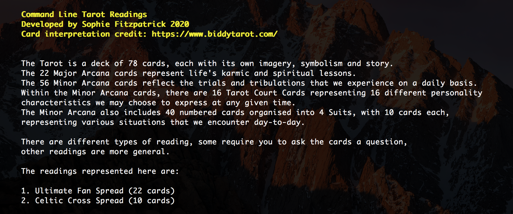
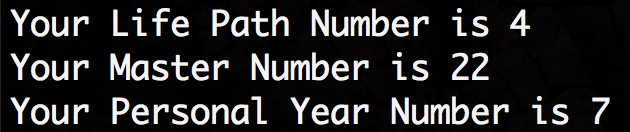

# Command Line Tarot (and Life Number Calculator)

April 2020

A command line tarot reading, with the option of two spreads (the "Celtic" and the "Fan").

Card meanings by https://www.biddytarot.com/

As for interpratation, I've not got that far `¯\_(ツ)_/¯` - but there are lots
of resources online to help you!

## Inspiration

Found my tarot cards, and decided it might be a fun little programming project. Left it at two readings, but might add some more later or perhaps some more detailed interpretation of the cards.

## Getting Started

1. `git clone https://github.com/sophiefitzpatrick/department-of-mysteries.git`
2. `python3 run.py`

## Extra

Not included in the main flow, but also the option to calculate your Life Path Number, Master Number and your Personal Year Number.

Your Life Path Number will remain with you across your life time. It governs who you are. Not everyone has a Master number, but if you do - it speaks of an old soul, a master builder and master teacher - and largely overrides your Life Path Number. These are 11, 22, 33.

Your Personal Year Number changes with each year and helps you evaluate the trend of the year you would like to know about. Personal Year Numbers are in a 9 year cycle.

For your number interpretation:
https://numerology.astro-seek.com/life-path-number-online-calculator
https://numerology.astro-seek.com/personal-year
https://www.numerology.com/numerology-news/master-numbers

The example above is mine for my birth date and this year (2020).

Personal Year - 7 - https://numerology.astro-seek.com/personal-year/7
Life Number - 4 - https://numerology.astro-seek.com/life-path-number/4
And I have a Master Number - 22 - https://www.numerology.com/numerology-news/master-numbers

To calculate:
1. `git clone https://github.com/sophiefitzpatrick/department-of-mysteries.git`
2. Edit the two function calls at the end of the file with your birth date and the year you want to know about i.e. day, month, year | 20, 04, 2020
3. `python3 life_numbers.py`

My intention was to add this to the main flow.